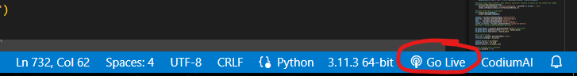

# 🐍📜 PyScript with GitHub Codespaces and Copilot

## 🗃️ **INSTRUCTIONS:
 
->GO BACK TO NOTION AND KEEP READING (step 2) TO LOAD VS-CODE

 

   ***TO RUN CODE, PRESS THIS: 
   
  (you will only be able to do this after you load vs-code by following the notion instructions)

  

## 🚀 Description (optional read):
 
You can create, customize and deploy your own PyScript website in minutes. ✨
The repo contains the following:

* `.devcontainer/devcontainer.json`: Configuration file used by Codespaces to
  configure Visual Studio Code settings, such as the enabling of additional
  extensions.
* `config.json`: the
  [PyScript configuration](https://docs.pyscript.net/2024.6.1/user-guide/configuration/)
  used by your application.
* `index.html`: the
  [HTML page](https://docs.pyscript.net/2024.6.1/user-guide/first-steps/)
  used to load your PyScript application.
* `main.py`: the [Python script](https://pyscript.net/) to run.
* `mini-coi.js`: a
  [utility](https://docs.pyscript.net/2024.6.1/user-guide/workers/#http-headers)
  to ensure all PyScript's features are available.
* `README.md`: this file (that you're reading right now).

This PyScript project contains everything you need so that you can immediately
open Codespaces, see it running, and deploy at any point.

Your development environment is all set for you to start.

* Visual Studio Code with the [Python plugin](https://code.visualstudio.com/docs/languages/python) enabled.
* The [LiveServer](https://marketplace.visualstudio.com/items?itemName=ritwickdey.LiveServer) plugin (so you can view your site).
* GitHub [copilot support](https://github.com/features/copilot) (if you have it enabled for your account).
